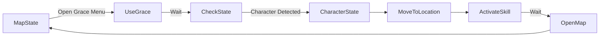
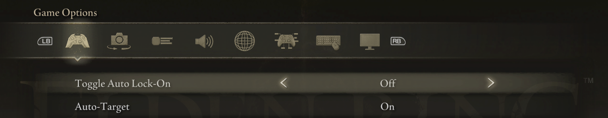
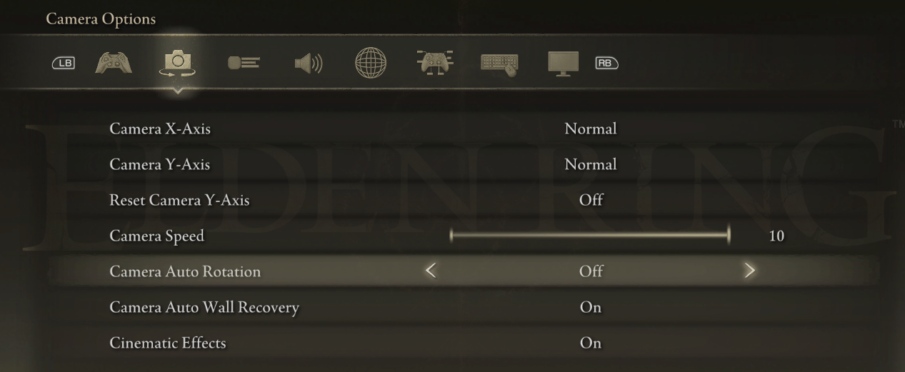
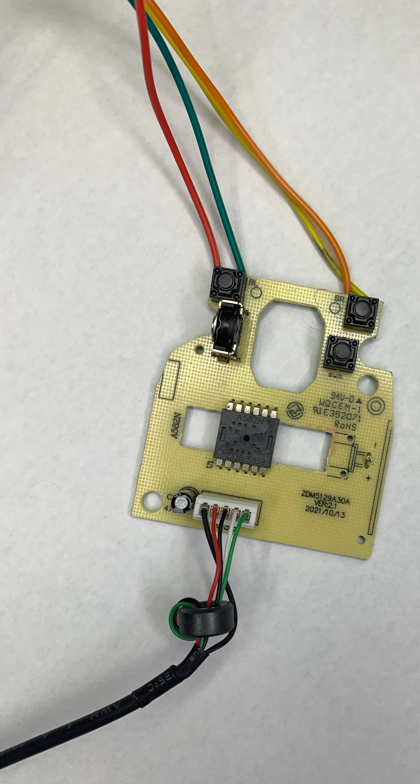
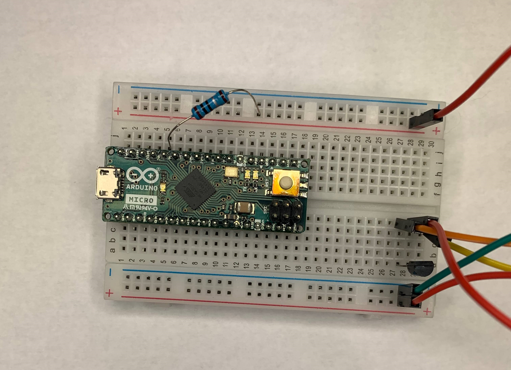

# Elden Ring Rune Farming (ERRF)

## Table of Contents
- [Description](#description)
- [Directory](#directory)
- [How It Works](#how-it-works)
- [Usage](#usage)
- [Disclaimer](#disclaimer)
- [License](#license)

##
### Description
This program is designed to automate the process of farming runes in Elden Ring. It uses YOLO (You Only Look Once) object detection to detect state ingame and perform actions accordingly. As an aside, this project was made quickly and is not perfect. It is a proof of concept and should be used as such. I will take issues and pull requests, but I will not be actively maintaining this project. If you would like to maintain this project, please contact me.
#### P.S.
I started to implement a GUI for this project due to some async issues with the current implementation. I will not be finishing the GUI, but I will leave the code in the repository for anyone who would like to finish it. 
### Directory
```
.
├── README.md
├── eldenring-detect.pt
├── eldenring-detect-v4.pt
├── main_ui.py
├── main.py
├── main.tcss
├── /screenshots
├── /arduino
└── /data
    ├── /raw
    ├── /util
    ├── test_model.py
    ├── /yolo
    └── train.py 
```
- `README.md` - This file.
- `eldenring-detect.pt` - The YOLO model used for object detection.
- `main.py` - The main program.
- `/screenshots` - Screenshots used for this file.
- `/arduino` - Arduino code for the controller.
- `/data` - Data used for training the YOLO model.
    - `/raw` - Raw data used for training.
    - `/util` - Utility functions for data processing.
    - `test_model.py` - Test the YOLO model.
    - `/yolo` - Different iterations of the data with labels and separation of training and testing data.
### How It Works
The program uses the YOLO model to detect the state of the game. Then depending the what the state the character is in will choose an action such as opening the map, walking, or using a skill. The program will then wait for the action to be completed and continue in the cycle based on the previous state. The program will continue to loop until the user stops the program. Example diagram below.

### Usage
First, in Eldenring certain settings need to be set in order for the program to work. The settings are as follows:
- Under the `Game` tab, ensure that `Toggle Auto Lock-On` is set to `Off`, and that `Auto-Target` is set to `On`.

- Under the `Camera` tab, set `Camera Auto Rotation` to `Off`.

- If you have changed the default bindings for keyboard and mouse, you will need to change them to back to default. The program uses the default bindings for the game.

To use this program, you'll need to either install the packages in the `environment.yml` file or run something like `conda env create --name envname --file=environment.yml`. This will create a conda environment with the necessary packages.

After installing the necessary packages, you'll need to run the program with the following command `python main.py #`. The `#` is the number indicting the type of farm route you would like to use. The options are as follows:
- `1` - Boulder farm route.
- `2` - Ritual Sword route. Requires a mouse input device that can be controlled via the arduino, I used https://www.amazon.com/AmazonBasics-3-Button-Wired-Computer-1-Pack/dp/B005EJH6RW



### Disclaimer
I am not responsible for any bans or other consequences that may arise from using this program. Use at your own risk.
### License
The license can be found in the `LICENSE.md` file.